# Pure Stream

A family-friendly Android TV streaming app that connects to Plex media servers with advanced profanity filtering capabilities.

## Features

### 🎬 Plex Integration
- Seamless authentication with Plex accounts via OAuth 2.0
- QR code login support for TV devices
- WebView authentication for mobile devices
- Real-time media library synchronization
- Support for multiple Plex servers

### 👨‍👩‍👧‍👦 Family-Friendly Content Filtering
- **4-Tier Profanity Filter System**: None, Mild, Moderate, Strict
- **Real-time Subtitle Analysis**: Automatic profanity detection using OpenSubtitles integration
- **Audio Muting**: Intelligent audio muting during profanity events
- **Custom Filter Lists**: Add custom words to filter or whitelist
- **Profile-Based Settings**: Each user profile maintains individual filter preferences

### 📱 User Profiles
- Multiple user profiles with unique avatars (13 animal-themed options)
- Child profiles with parental controls
- Per-profile library selection and filter settings
- Profile persistence across sessions

### 🎮 Android TV Optimized
- Leanback launcher support
- D-pad navigation throughout the app
- Focus management for seamless TV navigation
- Grid layouts optimized for large screens
- Virtual keyboard with voice search

### 🎯 Media Player
- LibVLC integration with hardware acceleration
- **4K HDR Support**: Proper color space handling for HDR content
- Filtered subtitle display with timing adjustment
- Real-time profanity detection during playback
- Episode tracking and progress saving for TV shows
- Resume playback support
- Picture-in-Picture mode (mobile)

## Screenshots

### Android TV

<table>
  <tr>
    <td><br/><sub><b>Home Screen</b></sub></td>
    <td>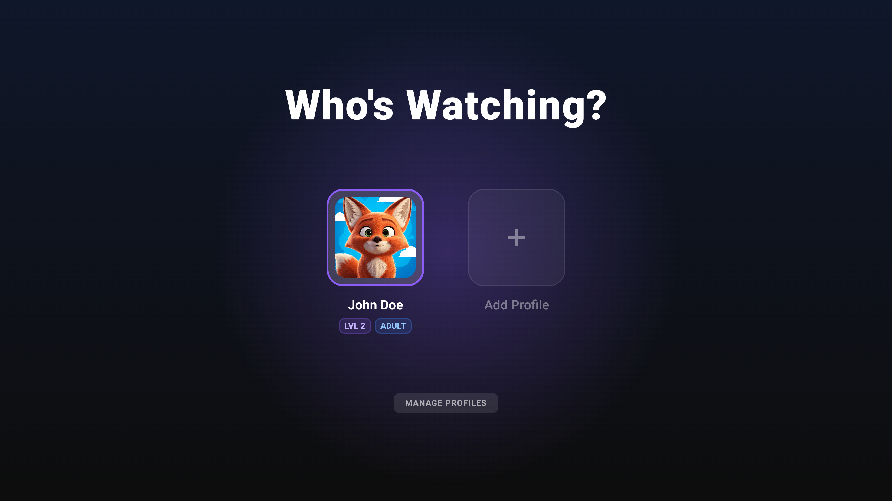<br/><sub><b>Profile Selection</b></sub></td>
  </tr>
  <tr>
    <td><br/><sub><b>Movie Details</b></sub></td>
    <td><br/><sub><b>TV Show Details</b></sub></td>
  </tr>
  <tr>
    <td>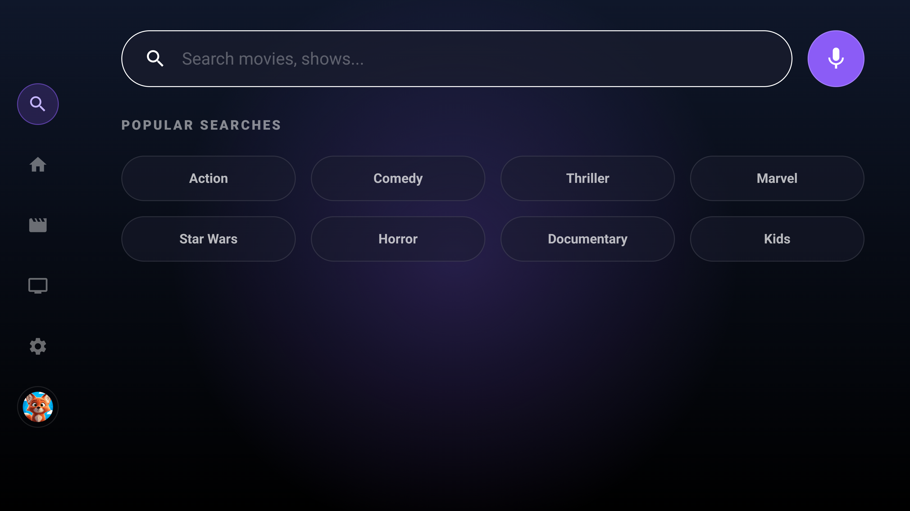<br/><sub><b>Search</b></sub></td>
    <td>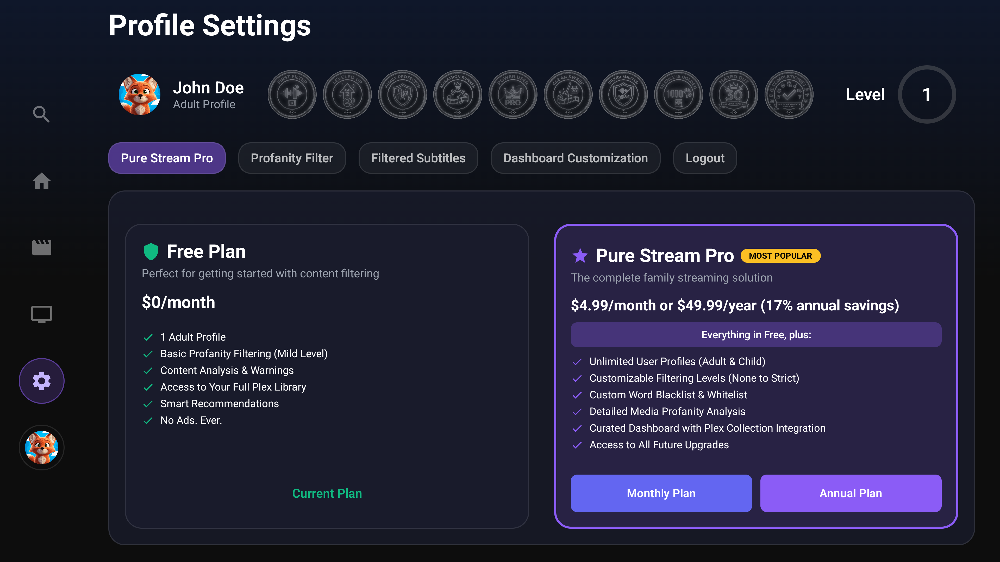<br/><sub><b>Settings</b></sub></td>
  </tr>
  <tr>
    <td><br/><sub><b>Profanity Filter Settings</b></sub></td>
    <td>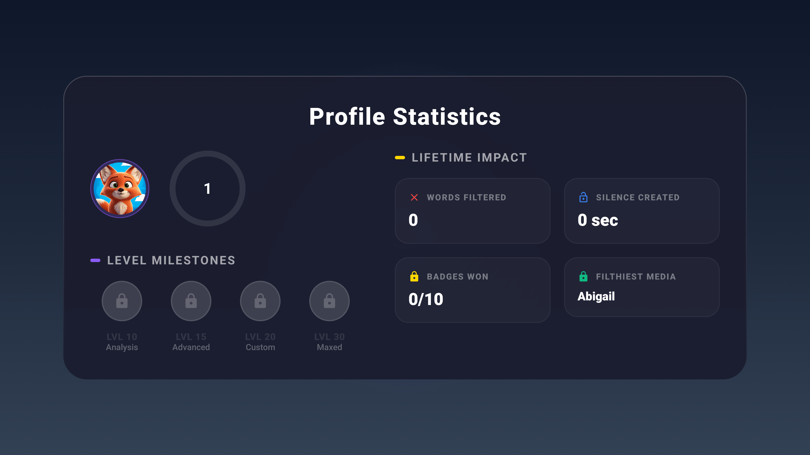<br/><sub><b>Profile Statistics</b></sub></td>
  </tr>
  <tr>
    <td>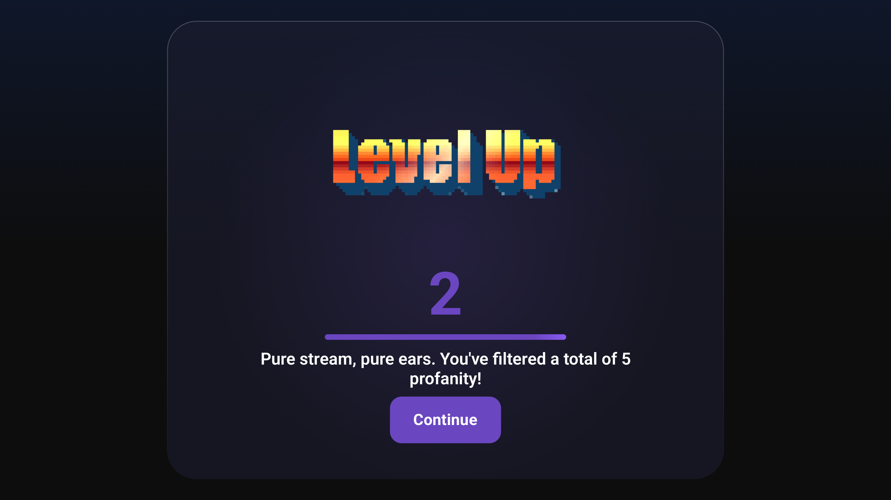<br/><sub><b>Level Up Celebration</b></sub></td>
    <td>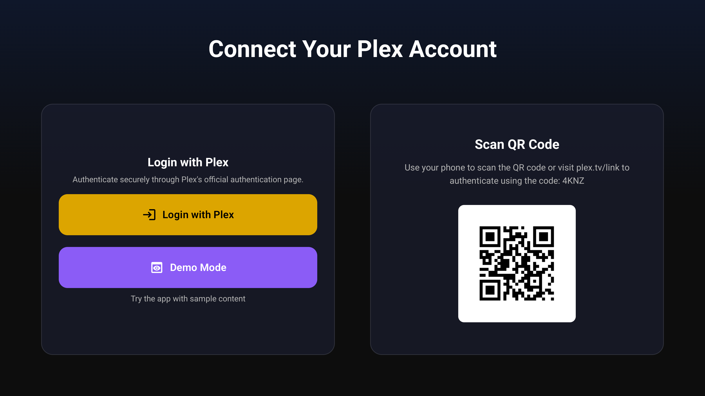<br/><sub><b>Connect to Plex</b></sub></td>
  </tr>
</table>

### Mobile

<table>
  <tr>
    <td><br/><sub><b>Home Screen</b></sub></td>
    <td>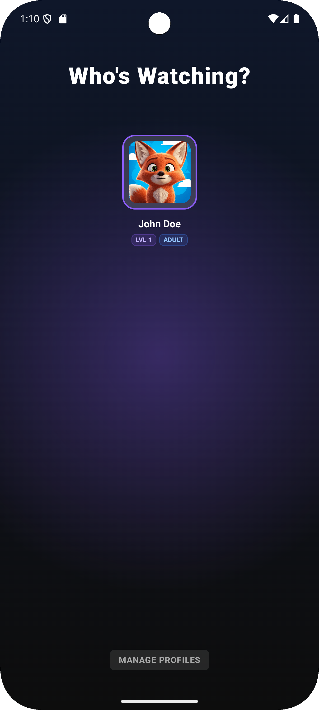<br/><sub><b>Profile Selection</b></sub></td>
    <td>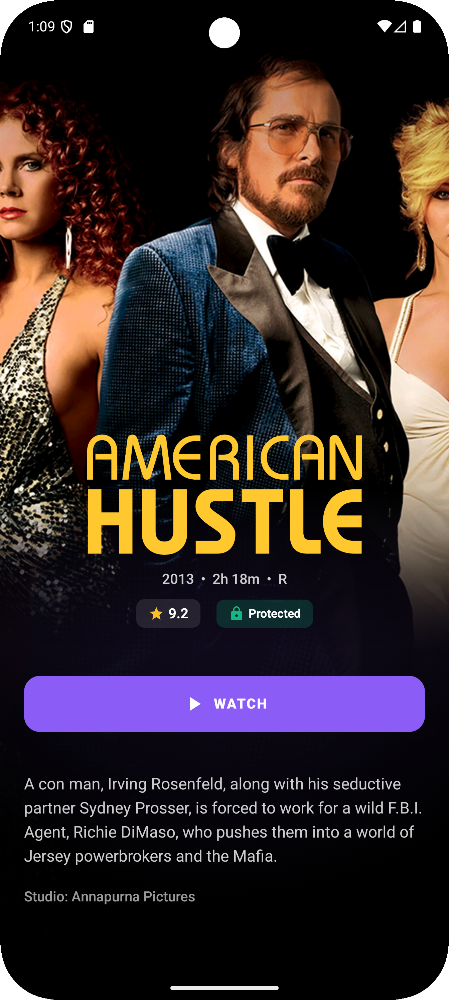<br/><sub><b>Movie Details</b></sub></td>
  </tr>
  <tr>
    <td><br/><sub><b>TV Show Details</b></sub></td>
    <td>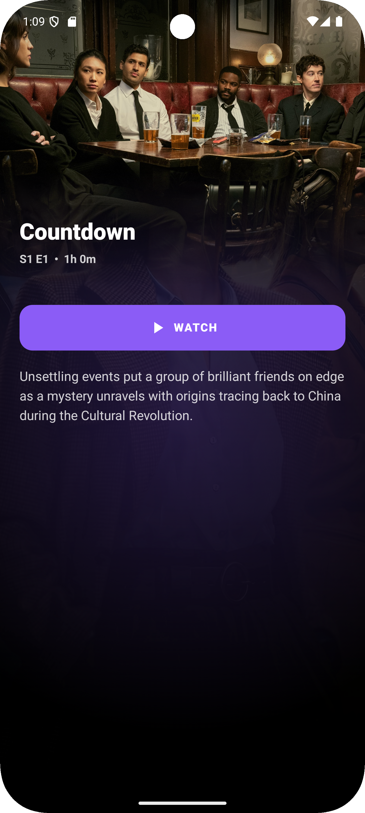<br/><sub><b>Episode Details</b></sub></td>
    <td>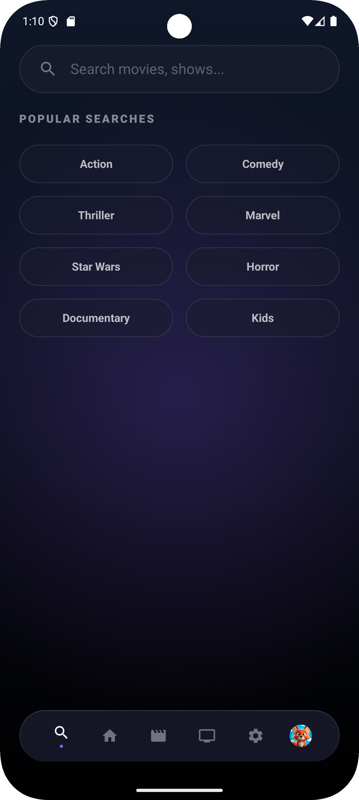<br/><sub><b>Search</b></sub></td>
  </tr>
  <tr>
    <td>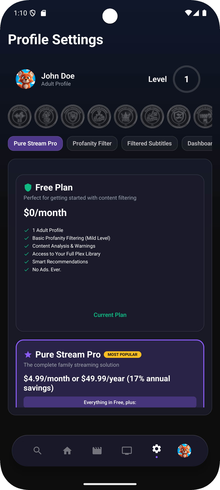<br/><sub><b>Settings</b></sub></td>
    <td>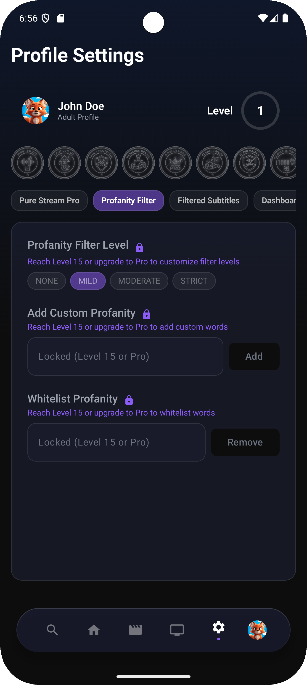<br/><sub><b>Profanity Filter</b></sub></td>
    <td>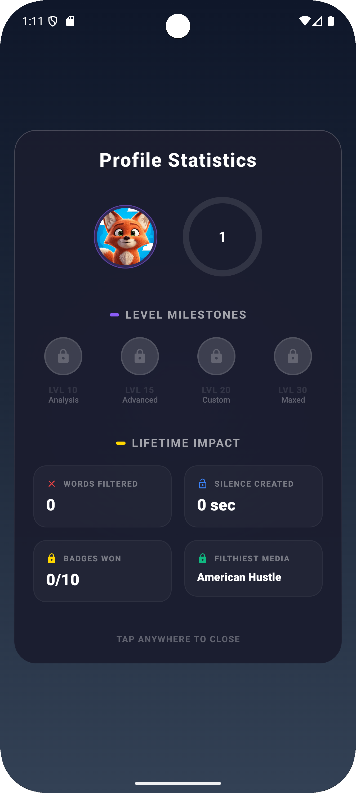<br/><sub><b>Profile Statistics</b></sub></td>
  </tr>
  <tr>
    <td>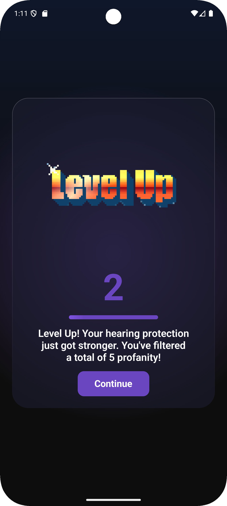<br/><sub><b>Level Up</b></sub></td>
    <td>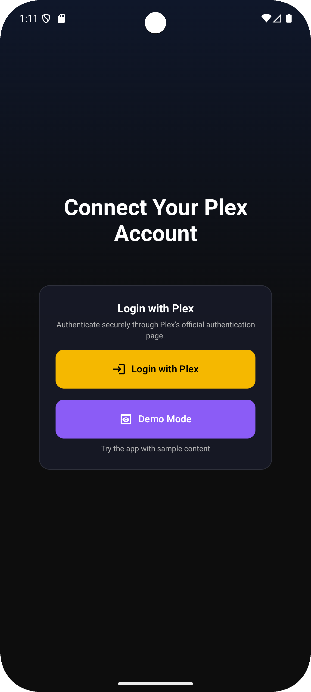<br/><sub><b>Connect to Plex</b></sub></td>
    <td></td>
  </tr>
</table>

## Requirements

- **Minimum SDK**: Android 9 (API 28)
- **Target SDK**: Android 15 (API 35)
- **Device Type**: Android TV or Android Mobile
- **Plex Account**: Required for media streaming

## Installation

### From Source

1. Clone the repository:
```bash
git clone https://github.com/yourusername/PureStream.git
cd PureStream
```

2. Open the project in Android Studio

3. Sync Gradle dependencies

4. Build the APK:
```bash
# Windows
.\gradlew.bat assembleDebug

# macOS/Linux
./gradlew assembleDebug
```

5. Install on device:
```bash
# Windows
.\gradlew.bat installDebug

# macOS/Linux
./gradlew installDebug
```

## Tech Stack

### Core Framework
- **Language**: Kotlin 1.9.24
- **UI Framework**: Jetpack Compose
- **Navigation**: Jetpack Navigation Compose
- **Architecture**: MVVM (Model-View-ViewModel)

### Libraries & Dependencies
- **Android TV**: Leanback, TV Material3
- **Networking**: Retrofit, OkHttp
- **Database**: Room
- **Media Playback**: LibVLC 3.6.5 (4K HDR support)
- **Image Loading**: Coil
- **Dependency Injection**: Manual (ViewModels with Repositories)
- **Coroutines**: Kotlin Coroutines with Flow
- **Background Tasks**: WorkManager

### APIs & Services
- **Plex API**: Media server integration
- **OpenSubtitles API**: Subtitle fetching and analysis
- **Plex OAuth**: Secure authentication

## Architecture

### MVVM Pattern
```
UI Layer (Compose)
    ↓
ViewModels (StateFlow)
    ↓
Repositories
    ↓
Data Sources (API Services, Room Database)
```

### Key Components

- **MainActivity.kt**: Single-activity architecture with Compose NavHost
- **Repositories**: PlexRepository, ProfileRepository, OpenSubtitlesRepository
- **ViewModels**: HomeViewModel, MoviesViewModel, TvShowsViewModel, MediaPlayerViewModel
- **Database**: Room database with 3 entities (Profile, SubtitleAnalysis, AppSettings)
- **Profanity Filter**: Multi-tier filtering system with custom word lists

## Project Structure

```
com.purestream/
├── data/
│   ├── api/              # Retrofit API services
│   ├── database/         # Room database, DAOs, entities
│   ├── manager/          # Business logic managers
│   ├── model/            # Data models
│   └── repository/       # Repository pattern implementations
├── profanity/            # Profanity filtering system
│   ├── ProfanityFilter.kt
│   ├── SubtitleAnalyzer.kt
│   └── FilteredSubtitleManager.kt
├── ui/
│   ├── components/       # Reusable UI components
│   ├── screens/          # Screen composables
│   ├── theme/            # App theming
│   └── viewmodel/        # ViewModels
└── utils/                # Utility classes
```

## Configuration

### Plex Authentication
The app uses Plex OAuth 2.0 with the following identifiers:
- Client ID: `f7f96c82-17e5-4b11-a52f-74b1107bd0fb`
- Product Name: `Pure Stream`
- Platform: `Android TV`

### Build Configuration
- **Compile SDK**: 35
- **Min SDK**: 28
- **Java Compatibility**: 1.8
- **Kotlin Compiler**: 1.5.14

## Contributing

Contributions are welcome! Please feel free to submit a Pull Request.

1. Fork the repository
2. Create your feature branch (`git checkout -b feature/AmazingFeature`)
3. Commit your changes (`git commit -m 'Add some AmazingFeature'`)
4. Push to the branch (`git push origin feature/AmazingFeature`)
5. Open a Pull Request

## License

This project is licensed under the MIT License - see the [LICENSE](LICENSE) file for details.

## Acknowledgments

- [Plex](https://www.plex.tv/) for their media server platform and API
- [OpenSubtitles](https://www.opensubtitles.com/) for subtitle data
- Android Jetpack team for excellent libraries and tools

## Support

For issues, questions, or feature requests, please [open an issue](https://github.com/yourusername/PureStream/issues).

---

**Note**: This app requires a Plex Media Server and valid Plex account to function. Pure Stream is not affiliated with or endorsed by Plex Inc.
